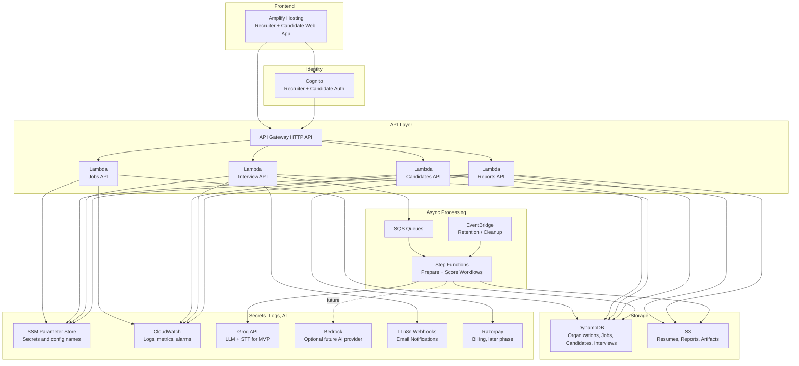
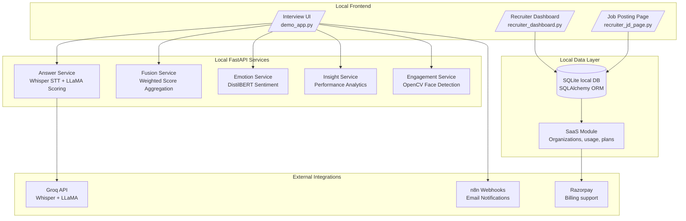
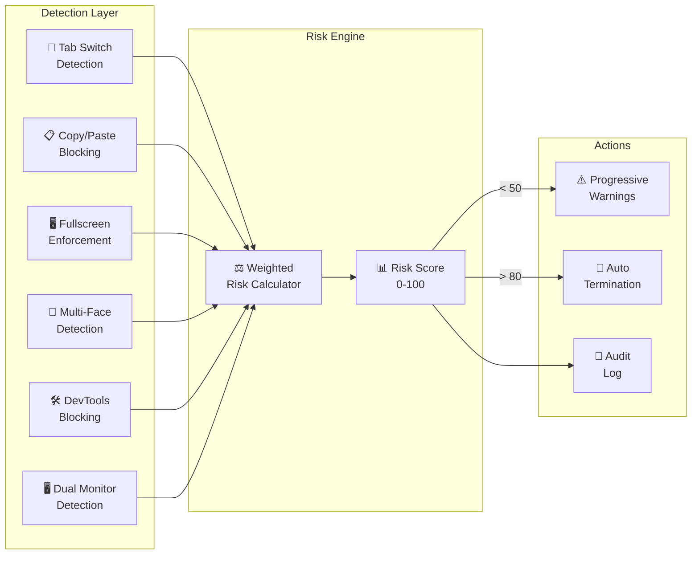
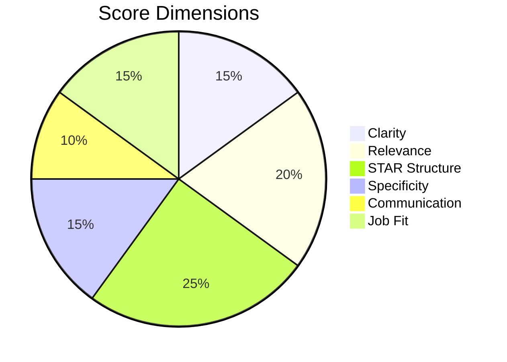

<p align="center">
  
</p>

<h1 align="center">PsySense AI — Behavioral Interview Intelligence</h1>

<p align="center">
  <strong>Enterprise-grade AI platform for automated behavioral interviews with multimodal scoring, real-time proctoring, and recruiter analytics.</strong>
</p>

<p align="center">
  
  
  
  
  
</p>

---

## 🎯 What is PsySense?

PsySense is a **full-stack AI interview platform** that automates the entire behavioral interview pipeline — from job posting to candidate scoring — with real-time proctoring and multimodal AI analysis. Think **HireVue**, but 10x more affordable and with transparent scoring.

### Key Capabilities

| Feature | Description |
|---------|-------------|
| 🤖 **AI Interview Engine** | Automated behavioral interviews with real-time speech-to-text and LLM scoring |
| 🎯 **STAR Method Scoring** | 6-dimensional evaluation: Clarity, Relevance, STAR Structure, Specificity, Communication, Job Fit |
| 🔒 **Enterprise Proctoring** | Tab switching detection, copy/paste blocking, fullscreen enforcement, multi-face detection |
| 📊 **Recruiter Dashboard** | Analytics, PDF reports, candidate comparison, and hiring pipeline management |
| 🧠 **Multimodal Fusion** | Combines cognitive (LLM), emotion (DistilBERT), and engagement (CV) scores |
| 💳 **SaaS Billing** | Multi-tenant subscriptions with Razorpay billing support and usage quotas |

---

## Product Status

PsySense AI is positioned as a **sellable MVP / pilot-ready SaaS product** for AI-assisted behavioral interview screening. The current codebase includes the recruiter workflow, candidate workflow, AI scoring services, proctoring signals, multi-tenant SaaS foundation, billing foundation, production configuration, and deployment assets.

Recommended launch path:

1. Keep the current Streamlit/Docker app for local demos and product validation.
2. Use the new serverless implementation path for AWS.
3. Test the first serverless vertical slice with internal users.
4. Validate with 1-3 trusted recruiters or placement teams after serverless MVP approval.
5. Move toward broader SaaS launch after pilot feedback.

AWS production must follow the CEO-approved serverless-only rule. Do not create VPC, EC2, RDS, OpenSearch, SageMaker, ECS/EKS, NAT Gateway, Load Balancer, ElastiCache, or Redshift.

PsySense should be positioned as **human-in-the-loop decision support**. The platform provides structured interview insights, scores, reports, and integrity signals for recruiter review. Final hiring decisions remain with the employer or recruiter.

---

## What Has Been Completed

### Core Product Workflow

- Recruiter signup/login and organization context.
- Job posting creation with job description input.
- Resume upload and parsing.
- Resume-to-JD matching and candidate shortlisting support.
- Candidate invite/login flow.
- JD/resume-aware behavioral question generation.
- Candidate interview flow with camera, microphone, and fullscreen setup.
- Speech-to-text transcription and LLM-based scoring.
- Recruiter dashboard with candidate comparison and analytics.
- Candidate PDF report export.

### AI and Evaluation

- STAR-method answer scoring.
- Six-dimensional behavioral scoring: clarity, relevance, STAR structure, specificity, communication, and job fit.
- Multimodal score fusion using cognitive, emotion, and engagement signals.
- Per-question breakdowns for recruiter review.
- AI-generated recommendations and insight summaries.

### Proctoring and Trust Signals

- Tab-switch detection.
- Copy/paste blocking and logging.
- Fullscreen enforcement.
- DevTools attempt detection.
- Multiple-face detection.
- Engagement and attention signals.
- Weighted proctoring risk score.
- Proctoring events included in recruiter review and reports.

### SaaS and Commercial Foundation

- Multi-tenant organization model using `org_id`.
- Trial, Starter, Pro, and Enterprise plan structure.
- Monthly usage quota tracking.
- Billing UI and subscription event logs.
- Razorpay payment order and webhook support.
- API key and middleware foundation for future integrations.

### Trust and Compliance Readiness Added

The project now includes pilot-ready trust and policy documents:

- `docs/PRIVACY_POLICY.md`
- `docs/TERMS_OF_USE.md`
- `docs/CANDIDATE_CONSENT.md`
- `docs/DATA_RETENTION_POLICY.md`
- `docs/AI_EVALUATION_DISCLAIMER.md`
- `docs/CEO_SAAS_PROJECT_BRIEF.md`

The app also includes AI decision-support disclaimers in:

- Candidate interview start flow.
- Recruiter dashboard.
- Candidate detail page.
- PDF reports.

---

## 🏗️ AWS Serverless Architecture

This is the approved AWS production direction. It uses only CEO-approved serverless services and does not create VPC, EC2, RDS, OpenSearch, SageMaker, ECS/EKS, NAT Gateway, Load Balancer, ElastiCache, or Redshift.



### Current Serverless MVP Slice

The `serverless/` folder contains the first approved AWS slice:

```text
Cognito-authenticated recruiter
  -> API Gateway
  -> Jobs / Candidates / Prepare Interview Lambdas
  -> Candidate Interview Lambda
  -> Scoring API + Step Functions + Scoring Lambda
  -> DynamoDB + S3
  -> Groq via SSM-managed API key
```

Implemented:

- `POST /jobs` creates a job posting.
- `GET /jobs` lists job postings scoped by organization.
- `POST /jobs/{jobId}/candidates` creates candidate metadata and returns an S3 presigned resume upload URL.
- `GET /jobs/{jobId}/candidates` lists candidates scoped by organization and job.
- `POST /jobs/{jobId}/candidates/{candidateId}/prepare-interview` reads the uploaded resume from S3, combines it with job/candidate metadata from DynamoDB, generates questions, and stores prepared interview data.
- `GET /jobs/{jobId}/candidates/{candidateId}/interview` returns prepared questions for the candidate interview flow.
- `POST /jobs/{jobId}/candidates/{candidateId}/interview` stores candidate answers, consent confirmation, and lightweight integrity signals.
- `POST /jobs/{jobId}/candidates/{candidateId}/score` starts the Step Functions scoring workflow.
- `GET /jobs/{jobId}/candidates/{candidateId}/result` returns the latest recruiter scoring result and a presigned PDF report download URL when generated.
- SAM template scan passes with zero blocked AWS resource types.

---

## 🧪 Local Demo Architecture

The existing Streamlit/FastAPI app remains the local demo and product-validation environment. It is not the AWS production deployment path.



---

## 🔄 Interview Pipeline

```mermaid
sequenceDiagram
    participant R as 👔 Recruiter
    participant P as 🖥️ PsySense
    participant C as 🎓 Candidate
    participant AI as 🤖 AI Engine

    rect rgb(30, 41, 59)
    Note over R,P: Phase 1 — Setup
    R->>P: Create Job Posting + Upload JD
    R->>P: Upload Candidate Resumes (PDF)
    P->>AI: LLM Resume Parsing & Matching
    AI-->>P: Match Scores + Shortlist
    R->>P: Select & Invite Candidates
    P->>C: 📧 Email Invite (n8n webhook)
    end

    rect rgb(30, 58, 41)
    Note over C,AI: Phase 2 — Interview
    C->>P: Login + Accept Proctoring Terms
    P->>P: 🔒 Enable Fullscreen + Proctoring
    loop For Each Question (5 questions)
        P->>C: 🔊 TTS Question (gTTS)
        C->>P: 🎤 Answer via WebRTC Audio
        P->>AI: Whisper STT → Transcript
        P->>AI: LLaMA STAR Scoring (6 dims)
        P->>AI: DistilBERT Emotion Analysis
        P->>AI: OpenCV Engagement Tracking
        AI-->>P: Cognitive + Emotion + Engagement Scores
        P->>P: Fusion Score = Weighted Average
    end
    P->>P: 🔒 Log Proctoring Events
    end

    rect rgb(58, 30, 41)
    Note over R,P: Phase 3 — Review
    R->>P: Open Recruiter Dashboard
    P-->>R: 📊 Analytics + Per-Question Breakdown
    P-->>R: 📄 PDF Report Download
    P-->>R: 🔒 Proctoring Risk Score
    R->>R: Hire / Reject Decision
    end
```



---

## 🔒 Proctoring System

PsySense includes an enterprise-grade anti-cheating system with **weighted risk scoring**:



| Event | Weight | Threshold |
|-------|--------|-----------|
| Tab switch | 15 pts | 3 warnings → terminate |
| Copy/paste attempt | 10 pts | Blocked + logged |
| Fullscreen exit | 20 pts | Auto re-enter |
| Multiple faces | 25 pts | Immediate flag |
| DevTools open | 20 pts | Blocked + logged |

---

## 🧠 AI Scoring Engine

Each candidate answer is scored across **6 dimensions** using LLaMA 3.1 70B:



**Final Score Formula:**
```
Final Score = (0.50 × Cognitive) + (0.20 × Emotion) + (0.30 × Engagement)
```

Where:
- **Cognitive** = LLaMA STAR evaluation (answer quality)
- **Emotion** = DistilBERT sentiment analysis (confidence, enthusiasm)
- **Engagement** = OpenCV face tracking (attention, presence)

---

## 🚀 Quick Start

### Prerequisites
- Python 3.10+
- [Groq API Key](https://console.groq.com/) (free tier available)

### Local Development

```bash
# Clone the repository
git clone https://github.com/anbunathanr/ai-behavioral-interviewer-proctoring.git
cd ai-behavioral-interviewer-proctoring

# Create virtual environment
python -m venv venv
source venv/bin/activate  # Windows: venv\Scripts\activate

# Install dependencies
pip install -r requirements.txt

# Configure environment
cp deploy/.env.production.template .env
# Edit .env with your GROQ_API_KEY

# Start all microservices
python -m uvicorn answer_service.main:app --port 8000 &
python -m uvicorn fusion_service.main:app --port 8001 &
python -m uvicorn emotion_service.main:app --port 8002 &
python -m uvicorn insight_service.main:app --port 8003 &
python -m uvicorn engagement_service.main:app --port 8004 &

# Start the UI
streamlit run demo_app.py
```

Or use the batch script:
```bash
.\run_system.bat
```

### Docker Deployment

Docker Compose is retained for local/dev validation of the existing app only. It is not the approved AWS production deployment path.

```bash
# Local/dev only
docker compose -f deploy/docker-compose.prod.yml up -d --build

# Check local/dev logs
docker compose -f deploy/docker-compose.prod.yml logs -f
```

---

## AWS Serverless Deployment Requirements

AWS production must use only approved serverless services:

- Amplify
- Cognito
- API Gateway
- Lambda
- DynamoDB
- S3
- SQS
- Step Functions
- EventBridge
- CloudWatch
- SSM Parameter Store
- Optional Bedrock
- CloudFormation / AWS SAM

Do not create VPCs, EC2, RDS, OpenSearch, SageMaker, ECS/EKS, NAT Gateways, Load Balancers, ElastiCache, or Redshift.

### Current Serverless MVP

The `serverless/` folder contains the first approved AWS path:

- `serverless/template.yaml`: SAM template using approved serverless services.
- `serverless/backend/handlers/jobs.py`: Jobs API Lambda handler.
- `serverless/backend/handlers/candidates.py`: Candidate metadata and resume upload URL handler.
- `serverless/backend/handlers/prepare_interview.py`: Resume-to-question preparation Lambda handler.
- `serverless/backend/handlers/candidate_interview.py`: Candidate question delivery and answer submission handler.
- `serverless/backend/handlers/scoring.py`: Recruiter scoring workflow/result API handler.
- `serverless/backend/handlers/scoring_worker.py`: Step Functions worker Lambda that scores submitted interviews.
- `serverless/backend/repositories/jobs_repository.py`: DynamoDB-backed jobs repository.
- `serverless/backend/repositories/candidates_repository.py`: DynamoDB + S3 repository for candidate metadata and resume upload URLs.
- `serverless/backend/repositories/interviews_repository.py`: DynamoDB + S3 repository for interview preparation.
- `serverless/backend/repositories/candidate_interviews_repository.py`: DynamoDB repository for candidate interview delivery and submissions.
- `serverless/backend/repositories/scoring_repository.py`: DynamoDB repository for submissions and scoring results.
- `tests/test_serverless_jobs.py`, `tests/test_serverless_candidates.py`, `tests/test_serverless_prepare_interview.py`, `tests/test_serverless_candidate_interview.py`, and `tests/test_serverless_scoring.py`: serverless slice tests.

Implemented first flow:

1. Cognito-authenticated recruiter request.
2. `POST /jobs` creates a job posting.
3. Lambda writes the job to DynamoDB.
4. `GET /jobs` lists jobs scoped by organization.
5. `POST /jobs/{jobId}/candidates` stores candidate metadata and returns a presigned S3 resume upload URL.
6. `GET /jobs/{jobId}/candidates` lists candidates scoped by organization and job.
7. Recruiter uploads the candidate PDF resume to S3 using the presigned URL.
8. `POST /jobs/{jobId}/candidates/{candidateId}/prepare-interview` reads resume bytes from S3, extracts resume text, generates five interview questions with keywords, and stores the prepared interview on the candidate record.
9. `GET /jobs/{jobId}/candidates/{candidateId}/interview` returns prepared questions to the candidate flow.
10. `POST /jobs/{jobId}/candidates/{candidateId}/interview` stores answers, consent confirmation, and tab/fullscreen/copy-paste/DevTools integrity signals.
11. `POST /jobs/{jobId}/candidates/{candidateId}/score` starts the Step Functions scoring workflow.
12. Scoring Lambda reads job, candidate, and latest submission data from DynamoDB, computes per-question scores, final score, recommendation, and integrity risk.
13. Scoring Lambda generates a recruiter PDF report and saves it to S3.
14. `GET /jobs/{jobId}/candidates/{candidateId}/result` returns the latest recruiter scoring result with a presigned PDF report download URL.

### Production Secrets

Production secrets should be stored in SSM Parameter Store and referenced by name. Do not commit real values.

Required secret/config names for the serverless MVP and next phases:

```env
GROQ_API_KEY_PARAMETER_NAME=/psysense/dev/GROQ_API_KEY
N8N_INVITE_WEBHOOK_PARAMETER_NAME=/psysense/dev/N8N_INVITE_WEBHOOK
N8N_RESULT_WEBHOOK_PARAMETER_NAME=/psysense/dev/N8N_RESULT_WEBHOOK
RAZORPAY_KEY_ID_PARAMETER_NAME=/psysense/dev/RAZORPAY_KEY_ID
RAZORPAY_KEY_SECRET_PARAMETER_NAME=/psysense/dev/RAZORPAY_KEY_SECRET
```

### Deployment Guardrail

Before any AWS deployment, validate the generated CloudFormation template and confirm it contains zero blocked services.

The first serverless deployment must be reviewed and approved before any resources are created.

See `docs/SAFE_AWS_DEV_DEPLOYMENT_CHECKLIST.md` for exact PowerShell validation and deployment commands.

See `docs/SERVERLESS_FRONTEND_API_INTEGRATION_PLAN.md` for the Amplify/Cognito/API Gateway frontend migration plan.

---

## 📁 Project Structure

```
psysense/
├── demo_app.py                 # Main Streamlit application
├── recruiter_dashboard.py      # Recruiter analytics & reports
├── recruiter_jd_page.py        # Job posting management
├── database.py                 # SQLAlchemy ORM (PostgreSQL/SQLite)
├── config.py                   # Environment & production config
├── proctoring.py               # Server-side proctoring engine
├── proctoring_client.py        # Client-side proctoring JS injection
├── audio_capture_robust.py     # WebRTC audio → Whisper pipeline
├── voice_question.py           # TTS question delivery
├── engagement_realtime.py      # Real-time engagement tracking
├── resume_parser.py            # LLM-powered resume parsing
├── sentry_setup.py             # Error monitoring (Sentry)
│
├── answer_service/             # FastAPI: LLaMA scoring microservice
│   ├── main.py
│   ├── llm_engine.py           # Groq API integration
│   └── prompt.py               # STAR method prompt engineering
│
├── emotion_service/            # FastAPI: DistilBERT emotion analysis
│   ├── main.py
│   └── emotion_model.py        # Fine-tuned DistilBERT model
│
├── fusion_service/             # FastAPI: Score aggregation
├── insight_service/            # FastAPI: Performance analytics
├── engagement_service/         # FastAPI: OpenCV face tracking
│
├── saas/                       # Multi-tenant SaaS layer
│   ├── saas_auth.py            # Org signup/login
│   ├── saas_billing.py         # Razorpay billing and plan UI
│   ├── saas_db.py              # Organization & usage models
│   └── saas_middleware.py      # Tenant isolation middleware
│
├── deploy/                     # Legacy/local Docker deployment assets
│   ├── docker-compose.prod.yml # Local Docker stack, not AWS production
│   ├── nginx.conf              # Legacy reverse proxy config
│   └── .env.production.template
│
├── serverless/                 # Approved AWS serverless MVP path
│   ├── template.yaml           # SAM template with approved resources only
│   └── backend/                # Lambda handlers and repositories
│
├── Dockerfile                  # Multi-stage production build
├── supervisord.conf            # Multi-process orchestration
└── requirements.txt
```

---

## ⚙️ Environment Variables

| Variable | Required | Description |
|----------|----------|-------------|
| `GROQ_API_KEY` | ✅ | Groq Cloud API key for Whisper + LLaMA |
| `DATABASE_URL` | ✅ | `sqlite:///./psysense.db` or PostgreSQL URL |
| `RECRUITER_DEFAULT_PASSWORD` | ✅ | Default recruiter account password |
| `N8N_INVITE_WEBHOOK` | ⚠️ | n8n webhook for candidate email invites |
| `N8N_RESULT_WEBHOOK` | ⚠️ | n8n webhook for interview results |
| `WEBRTC_TURN_URLS` | ⚠️ | TURN server URLs (required in production) |
| `WEBRTC_TURN_USERNAME` | ⚠️ | TURN server username |
| `WEBRTC_TURN_PASSWORD` | ⚠️ | TURN server credential |
| `SENTRY_DSN` | ❌ | Sentry error monitoring DSN |
| `RAZORPAY_KEY_ID` | ❌ | Razorpay public key for billing |
| `RAZORPAY_KEY_SECRET` | ❌ | Razorpay secret key for billing |
| `RAZORPAY_WEBHOOK_SECRET` | ❌ | Razorpay webhook verification secret |
| `PASSWORD_RESET_SECRET` | ✅ | Secret used to sign password reset tokens |
| `APP_BASE_URL` | ✅ | Public application URL in production |
| `DATABASE_POOL_SIZE` | ❌ | PostgreSQL connection pool size (default: 5) |

---

## 💳 Subscription Plans

| Plan | Price | Interviews/month | Features |
|------|-------|-------------------|----------|
| **Trial** | Free (14 days) | 50 | Full access |
| **Starter** | $99/mo | 100 | Core features + proctoring |
| **Pro** | $299/mo | 500 | All features + analytics + PDF reports |
| **Enterprise** | Custom | Unlimited | White-label + API access + dedicated support |

---

## 🛡️ Security

- **Authentication**: bcrypt password hashing + session management
- **Multi-tenancy**: `org_id` isolation on all database queries
- **Proctoring**: Server-side event logging with tamper-proof audit trail
- **Data**: Plaintext passwords auto-cleared after invite email delivery
- **Transport**: HTTPS enforced in production + WebRTC encryption
- **Monitoring**: Sentry integration for real-time error tracking

---

## 📊 Tech Stack

| Layer | Technology |
|-------|-----------|
| **Frontend** | Streamlit for local demo; Amplify web app for AWS serverless path |
| **Backend** | FastAPI for local demo; API Gateway + Lambda for AWS serverless path |
| **AI/ML** | LLaMA 3.1 70B (Groq), Whisper Large V3, DistilBERT |
| **Computer Vision** | OpenCV (face detection, engagement) |
| **Database** | SQLite local demo; DynamoDB for AWS serverless path |
| **Audio** | WebRTC, PyAV, gTTS |
| **Billing** | Razorpay |
| **Deployment** | Local Docker for demo; AWS serverless via SAM/CloudFormation |
| **Monitoring** | Sentry |
| **Email** | n8n webhooks |

---

## 👥 Team

Built by the **Digitansol / PsySense** engineering team.

---

<p align="center">
  <strong>PsySense AI</strong> — Making interviews smarter, fairer, and faster.
</p>
