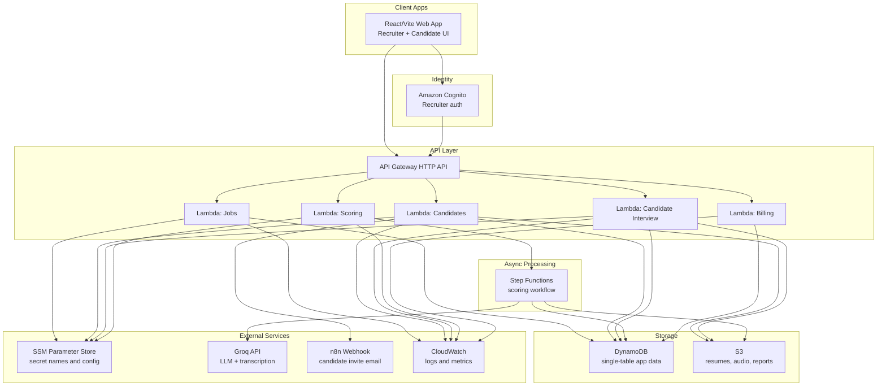
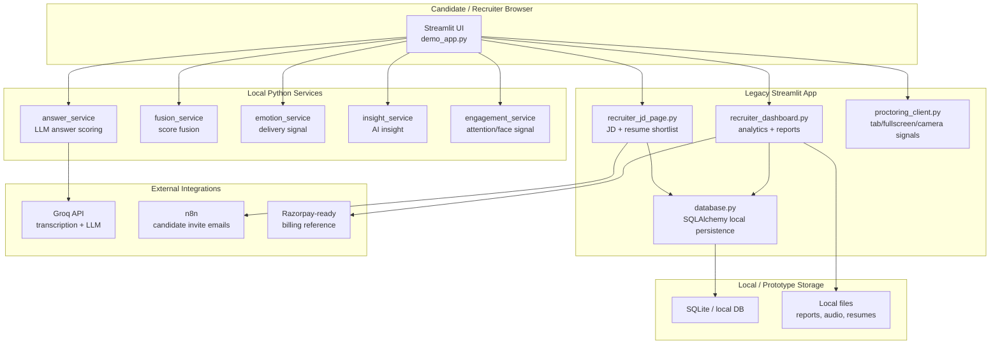

<div align="center">

# Talentryx AI

### AI Behavioral Interview, Resume Intelligence, and Proctoring SaaS

Talentryx AI helps recruiters run structured hiring drives: create jobs, analyze resumes against JDs, invite shortlisted candidates, run browser-based AI-assisted interviews, collect proctoring signals, and review explainable scorecards from a recruiter dashboard.

<p>
  <a href="https://github.com/anbunathanr/ai-behavioral-interviewer-proctoring/actions/workflows/ci.yml">
    
  </a>
  
  
  
</p>

<p>
  
  
  
  
  
  
  
  
  
  
  
  
  
  
  
  
  
  
  
  
  
  
  
</p>

</div>

---

## Executive Summary

Talentryx AI is a full-stack AI hiring platform for behavioral interviews and proctoring. It combines resume/JD intelligence, candidate credential-based interview access, browser proctoring, answer transcription, LLM-assisted scoring, PDF reporting, billing foundation, and a recruiter dashboard into a serverless SaaS architecture.

The product is built as a human-in-the-loop decision-support platform. AI scores, recommendations, and integrity signals are review aids, not final hiring decisions.

## Tech Stack

| Layer | Technologies |
| --- | --- |
| Frontend | React, TypeScript, Vite, lucide-react, browser media APIs |
| Backend | Python Lambda handlers, Flask local wrapper, repository/service layering |
| AWS serverless | Cognito, API Gateway HTTP API, Lambda, DynamoDB, S3, Step Functions, SSM Parameter Store, CloudWatch, SAM |
| AI and automation | Groq API for LLM/STT, n8n webhook invite automation |
| Reports and documents | PDF report generation, resume text extraction, S3 artifact storage |
| Legacy prototype | Streamlit, FastAPI microservices, SQLite/PostgreSQL-compatible SQLAlchemy layer, Plotly, WebRTC |
| Quality | GitHub Actions, pytest, Ruff, TypeScript build, SAM template validation |
| Commercial foundation | Billing usage tracking, plan model, Razorpay-ready legacy billing reference |

## Product Snapshot

| Area | What Talentryx AI Does |
| --- | --- |
| Recruiter workflow | Signup/login, job creation, resume/JD analysis, shortlist review, invite sending, dashboard review |
| Candidate workflow | Credential login, consent, camera/microphone setup, full-screen interview, answer capture, completion screen |
| AI assessment | Resume/JD-aware questions, transcription, STAR-style behavioral scoring, final recommendation |
| Proctoring | Tab switch detection, fullscreen exits, copy/paste attempts, devtools attempts, face visibility and multi-face events |
| Dashboard | Candidate status filters, final shortlist, reports, scorecards, proctoring risk, billing foundation |
| Deployment direction | AWS serverless only, under the CEO-approved resource guardrails |

## Why This Exists

High-volume hiring teams often need a repeatable way to evaluate communication, job fit, role understanding, and behavioral evidence before live interview rounds. Manual screening is slow, inconsistent, and difficult to audit.

Talentryx AI provides:

- A consistent interview experience for each candidate.
- Structured scoring across role-relevant behavioral questions.
- Recruiter-visible reasoning and score breakdowns.
- Integrity signals that help reviewers spot suspicious sessions.
- A serverless architecture that keeps the pilot cost controlled.

## Current Status

This repository contains two generations of the product:

```text
.
+-- serverless/          # Active AWS serverless SaaS implementation
+-- legacy-streamlit/    # Historical Streamlit prototype/reference app
+-- docs/                # Architecture, policy, deployment, and migration notes
+-- tests/               # Serverless-focused backend tests
`-- README.md            # This guide
```

The active product is `serverless/`.

The `legacy-streamlit/` folder is kept only as a reference for the original prototype, older dashboard ideas, and previous local demo behavior.

## Architecture Evolution

Talentryx AI started as a Streamlit prototype so the interview flow, recruiter dashboard, scoring reports, and proctoring ideas could be validated quickly. The active product has now moved to an AWS serverless architecture so it can become a deployable SaaS with cleaner auth, persistence, isolation, scaling, and cost controls.

| Generation | Folder | Purpose | Status |
| --- | --- | --- | --- |
| Streamlit prototype | `legacy-streamlit/` | Original demo app, old dashboard, local microservices, early scoring/proctoring UI | Reference only |
| AWS serverless SaaS | `serverless/` | Active recruiter/candidate product, Lambda APIs, React frontend, DynamoDB/S3 persistence, Cognito auth | Production direction |

The Streamlit version is intentionally preserved because it documents the product's early behavior and helps compare dashboard/reporting ideas. It is not the deployment target.

## Core Product Flow

```mermaid
flowchart LR
    A["Recruiter signs up or logs in"] --> B["Create job / hiring drive"]
    B --> C["Upload JD and candidate resumes"]
    C --> D["AI resume-to-JD shortlist"]
    D --> E["Recruiter reviews and sends invites"]
    E --> F["Candidate receives credentials"]
    F --> G["Candidate logs in and consents"]
    G --> H["Camera check and full-screen interview"]
    H --> I["Answers, transcript, and proctoring signals captured"]
    I --> J["Scoring workflow generates report"]
    J --> K["Recruiter dashboard shows scorecard, risk, and final shortlist"]
```



## Recruiter Experience

Recruiters can:

- Create job postings with title, description, deadline, open positions, and pass threshold.
- Upload one or more resumes for a job.
- Analyze candidates against the JD.
- Review and edit shortlisted candidate names/emails/college metadata before inviting.
- Send interview credentials through the configured invite provider.
- Track statuses such as invited, in progress, interview submitted, scored, passed, below threshold, and expired.
- View recent interview results and final ranked shortlists.
- Open full candidate reports with answer-level scoring and proctoring summary.
- Trigger retest flows when a completed candidate needs a fresh attempt.

## Candidate Experience

Candidates can:

- Log in only with recruiter-issued credentials.
- Access only their own interview flow, not the recruiter dashboard.
- Review AI/proctoring consent before starting.
- Complete camera and microphone setup.
- Attend the interview in a full-screen browser flow.
- Record/transcribe answers question by question.
- See completion confirmation after submission.

The candidate route is intentionally isolated from recruiter analytics, scoring internals, billing, and dashboard data.

## AI Assessment

The scoring system is designed around structured recruiter review, not black-box hiring automation.

Per question, the assessment can include:

- Clarity.
- Relevance.
- STAR quality.
- Specificity.
- Communication.
- Job fit.
- Summary.
- Strengths.
- Areas to improve.
- Recruiter-facing verdict.

The final report combines answer quality with integrity/proctoring risk to produce a decision-support recommendation.

## Proctoring and Integrity Signals

The browser interview flow captures lightweight integrity indicators:

- Tab switches.
- Fullscreen exits.
- Copy/paste attempts.
- DevTools attempts.
- Face-not-detected events.
- Multiple-face events.
- Session-level integrity risk.

These signals are shown to recruiters as context. They are not treated as automatic disqualification by themselves.

## Final Interview Shortlist

The dashboard supports final shortlist ranking based on interview score and each job's open positions.

Example:

- Job has `10` open positions.
- Minimum pass score is `60/100`.
- Candidates are ranked by interview score.
- The final shortlist shows the top candidates above threshold, up to the open position count.

This keeps final selection based on interview performance rather than manual checkbox selection.

## AWS Serverless Architecture

The production architecture follows a CEO-approved serverless-only constraint.



## Legacy Streamlit Architecture

The Streamlit prototype used a local-first architecture with one main UI app and several Python services. It was useful for fast experimentation, but it is not the approved production path.



## Why Serverless Replaced Streamlit for Production

| Need | Streamlit Prototype | AWS Serverless Product |
| --- | --- | --- |
| Recruiter/candidate isolation | App-level session logic | Cognito + API authorization boundaries |
| Data persistence | Local SQL-style app data | DynamoDB tenant-scoped records and S3 artifacts |
| Candidate invites | Local/n8n prototype flow | Stored candidate credentials + n8n webhook provider |
| Scaling | Single app/process-oriented | Lambda/API Gateway scale per request |
| Cost control | Local demo friendly | Pay-per-use serverless resources |
| Deployment governance | Docker/Streamlit-style deployment | SAM/CloudFormation under CEO guardrails |
| Auditability | Prototype history | Candidate status, submission, scoring, retest/audit foundation |

## CEO AWS Guardrails

Allowed production direction:

- Amazon Cognito.
- API Gateway HTTP API.
- AWS Lambda.
- Amazon DynamoDB.
- Amazon S3.
- AWS Step Functions.
- Amazon CloudWatch.
- AWS Systems Manager Parameter Store.
- AWS SAM / CloudFormation.
- n8n webhook for email invites.

Blocked unless leadership changes the instruction:

- EC2.
- RDS.
- VPC.
- NAT Gateway.
- Load Balancer.
- SES.
- SageMaker.
- ECS / EKS.
- OpenSearch.
- ElastiCache.
- Redshift.

The repo intentionally keeps secrets out of frontend code. Local secrets live in `.env`; deployed secrets belong in SSM Parameter Store. Frontend environment variables must stay limited to `VITE_*` values.

## Active Serverless Modules

```text
serverless/
+-- backend/
|   +-- handlers/         # Lambda entrypoints
|   +-- repositories/     # DynamoDB/S3 persistence layer
|   +-- services/         # AI, email, PDF, transcription, scoring
|   `-- shared/           # HTTP and identity helpers
+-- frontend/
|   +-- src/api/          # API client and types
|   +-- src/auth/         # Cognito/local auth handling
|   +-- src/candidate/    # Candidate interview experience
|   +-- src/recruiter/    # Recruiter dashboard and billing panel
|   +-- src/legal/        # Privacy, terms, proctoring notice pages
|   `-- src/app/          # App shell and routing
+-- template.yaml         # SAM template
+-- local_server.py       # Flask wrapper around Lambda handlers for local dev
`-- RUN_LOCAL.md          # Local development guide
```

## Key API Capabilities

| Capability | Path Pattern |
| --- | --- |
| Create/list jobs | `/jobs` |
| Create/list candidates | `/jobs/{jobId}/candidates` |
| Prepare interview | `/jobs/{jobId}/candidates/{candidateId}/prepare-interview` |
| Candidate interview | `/jobs/{jobId}/candidates/{candidateId}/interview` |
| Audio upload URL | `/jobs/{jobId}/candidates/{candidateId}/audio-upload-url` |
| Transcribe answer | `/jobs/{jobId}/candidates/{candidateId}/questions/{questionIndex}/transcribe` |
| Start scoring | `/jobs/{jobId}/candidates/{candidateId}/score` |
| Get result/report | `/jobs/{jobId}/candidates/{candidateId}/result` |
| Allow retest | `/jobs/{jobId}/candidates/{candidateId}/retest` |
| Billing summary | `/billing` |

## Local Development

Start the serverless frontend:

```powershell
cd serverless\frontend
npm.cmd install
npm.cmd run dev
```

Start the local API wrapper:

```powershell
cd serverless
python local_server.py
```

The local API wraps the same Lambda handler code used by AWS, but mocks cloud services where needed.

For more detail, read [serverless/RUN_LOCAL.md](serverless/RUN_LOCAL.md).

## Legacy Streamlit Prototype

The old Streamlit prototype is preserved in `legacy-streamlit/`.

Run it only when you need to compare old behavior:

```powershell
cd legacy-streamlit
streamlit run demo_app.py
```

or:

```powershell
cd legacy-streamlit
.\run_system.bat
```

Do not deploy the Streamlit prototype as the production SaaS.

## Testing and Quality

GitHub Actions runs:

- Backend serverless tests.
- Serverless Python compile checks.
- Frontend production build.
- Python lint checks for real errors.

Useful local checks:

```powershell
cd serverless\frontend
npm.cmd run build
```

```powershell
python -m compileall -q serverless\backend serverless\local_server.py
```

```powershell
python -m pytest tests\test_serverless_*.py
```

## Deployment Readiness

Before AWS deployment:

1. Get permission for the required IAM/SAM deployment actions.
2. Store private values in SSM Parameter Store.
3. Validate the SAM template.
4. Build with SAM so Lambda dependencies are packaged.
5. Scan the generated template for blocked AWS services.
6. Deploy the backend stack.
7. Connect frontend environment values from stack outputs.
8. Smoke test recruiter signup/login, job creation, invites, candidate login, interview, scoring, and report retrieval.

See [serverless/DEPLOYMENT_CHECKLIST.md](serverless/DEPLOYMENT_CHECKLIST.md).

## Trust, Privacy, and Compliance Position

Talentryx AI is designed as decision support.

The product includes:

- Candidate consent screen.
- Proctoring notice.
- Privacy and terms pages.
- AI decision-support disclaimer.
- Recruiter-facing warnings that scores require human review.
- Candidate isolation from recruiter dashboard data.
- Retest/audit trail foundation.

Important: production use still requires final legal review, data retention decisions, accessibility policy, and customer-specific compliance review.

## Documentation Map

| Document | Purpose |
| --- | --- |
| [docs/REPOSITORY_STRUCTURE.md](docs/REPOSITORY_STRUCTURE.md) | Repo layout and why legacy Streamlit is separated |
| [serverless/README.md](serverless/README.md) | Serverless implementation notes |
| [serverless/RUN_LOCAL.md](serverless/RUN_LOCAL.md) | Local serverless development flow |
| [serverless/DEPLOYMENT_CHECKLIST.md](serverless/DEPLOYMENT_CHECKLIST.md) | AWS deployment checklist |
| [serverless/BRANDING.md](serverless/BRANDING.md) | Talentryx AI branding and internal legacy naming note |
| [serverless/MULTI_COLLEGE_INTEGRATION_PLAN.md](serverless/MULTI_COLLEGE_INTEGRATION_PLAN.md) | Campus/multi-college expansion plan |
| [docs/PRIVACY_POLICY.md](docs/PRIVACY_POLICY.md) | Privacy policy draft |
| [docs/TERMS_OF_USE.md](docs/TERMS_OF_USE.md) | Terms draft |
| [docs/CANDIDATE_CONSENT.md](docs/CANDIDATE_CONSENT.md) | Candidate consent language |
| [docs/DATA_RETENTION_POLICY.md](docs/DATA_RETENTION_POLICY.md) | Retention policy draft |
| [docs/AI_EVALUATION_DISCLAIMER.md](docs/AI_EVALUATION_DISCLAIMER.md) | AI evaluation disclaimer |

## Roadmap

Near term:

- Keep CI green.
- Complete AWS deployment once permissions are available.
- Verify full production flow with one recruiter and one candidate.
- Finalize n8n email template with Talentryx AI branding.
- Add clearer audit/retest visibility in the recruiter dashboard.

Pilot hardening:

- Admin organization settings.
- Stronger recruiter password reset and verification UX.
- Exportable final shortlist CSV.
- More complete billing enforcement.
- Better report filtering and comparison views.
- CloudWatch alarms and operational runbooks.

Later expansion:

- Multi-college/campus drive management.
- College/department/graduation-year analytics.
- Customer-specific retention settings.
- Optional AWS-native AI provider evaluation.
- ATS/webhook integrations.

## Product Philosophy

Talentryx AI should make recruiters faster without pretending AI can replace human judgment.

The platform is built around four principles:

1. Keep the interview structured and repeatable.
2. Make scoring explainable enough for review.
3. Treat proctoring as context, not a silent automatic verdict.
4. Keep the architecture cost-controlled and deployable under strict AWS serverless constraints.

## License and Ownership

This repository is private/proprietary unless a separate license file says otherwise.

Do not commit real API keys, real webhook URLs, candidate personal data, production exports, or local database files.
