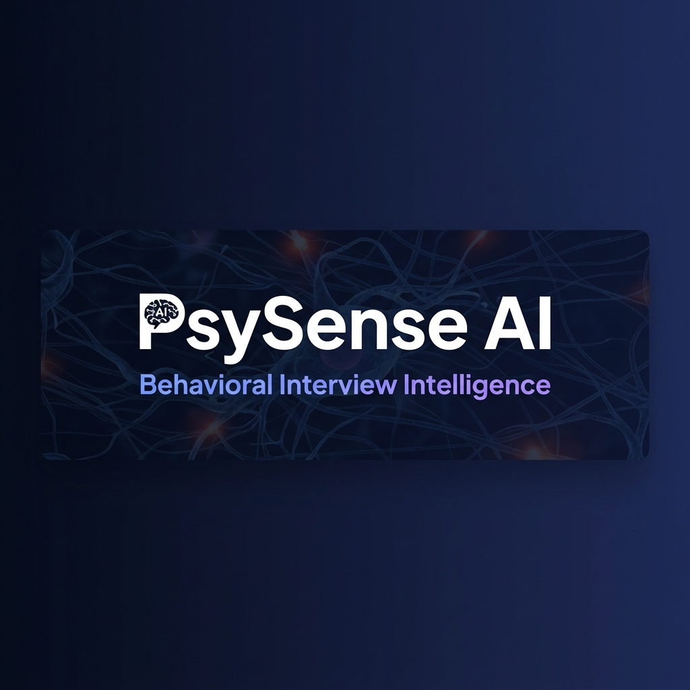
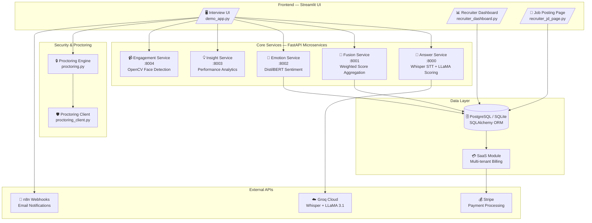
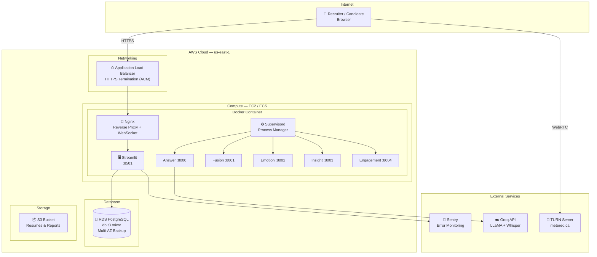
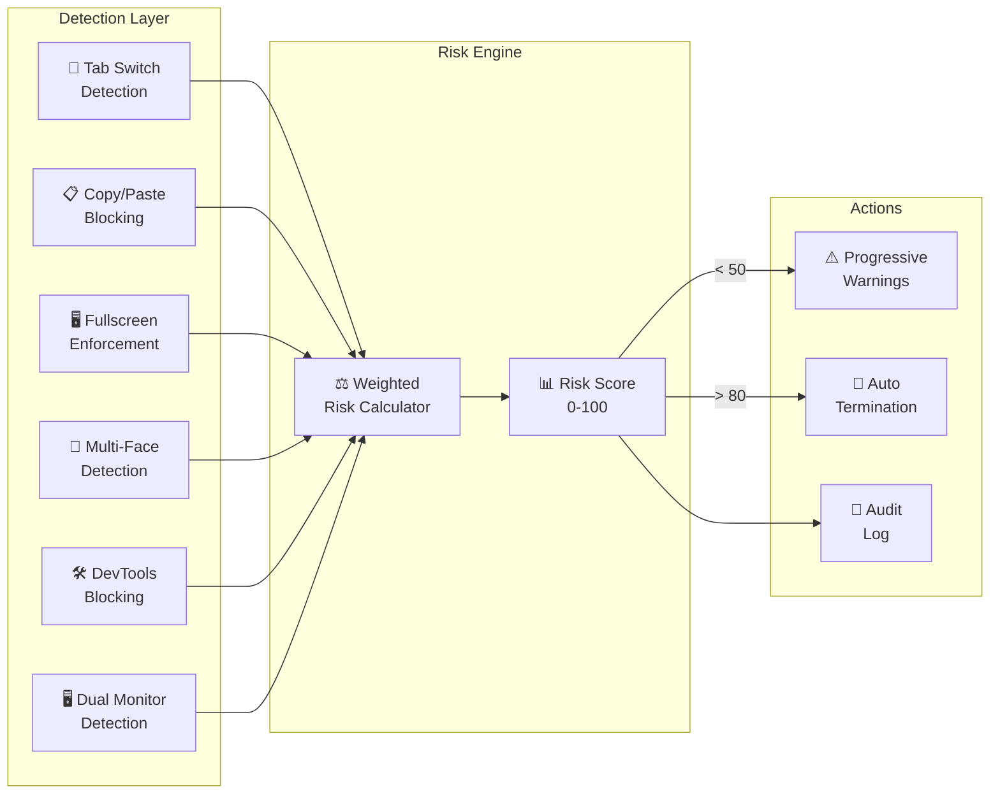
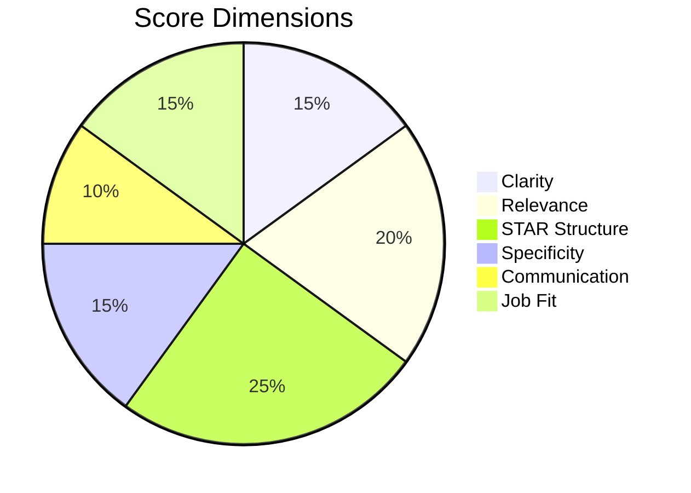

<p align="center">
  
</p>

<h1 align="center">PsySense AI — Behavioral Interview Intelligence</h1>

<p align="center">
  <strong>Enterprise-grade AI platform for automated behavioral interviews with multimodal scoring, real-time proctoring, and recruiter analytics.</strong>
</p>

<p align="center">
  
  
  
  
  
</p>

---

## 🎯 What is PsySense?

PsySense is a **full-stack AI interview platform** that automates the entire behavioral interview pipeline — from job posting to candidate scoring — with real-time proctoring and multimodal AI analysis. Think **HireVue**, but 10x more affordable and with transparent scoring.

### Key Capabilities

| Feature | Description |
|---------|-------------|
| 🤖 **AI Interview Engine** | Automated behavioral interviews with real-time speech-to-text and LLM scoring |
| 🎯 **STAR Method Scoring** | 6-dimensional evaluation: Clarity, Relevance, STAR Structure, Specificity, Communication, Job Fit |
| 🔒 **Enterprise Proctoring** | Tab switching detection, copy/paste blocking, fullscreen enforcement, multi-face detection |
| 📊 **Recruiter Dashboard** | Analytics, PDF reports, candidate comparison, and hiring pipeline management |
| 🧠 **Multimodal Fusion** | Combines cognitive (LLM), emotion (DistilBERT), and engagement (CV) scores |
| 💳 **SaaS Billing** | Multi-tenant subscriptions with Stripe integration and usage quotas |

---

## 🏗️ System Architecture



---

## ☁️ AWS Production Architecture



---

## 🔄 Interview Pipeline

```mermaid
sequenceDiagram
    participant R as 👔 Recruiter
    participant P as 🖥️ PsySense
    participant C as 🎓 Candidate
    participant AI as 🤖 AI Engine

    rect rgb(30, 41, 59)
    Note over R,P: Phase 1 — Setup
    R->>P: Create Job Posting + Upload JD
    R->>P: Upload Candidate Resumes (PDF)
    P->>AI: LLM Resume Parsing & Matching
    AI-->>P: Match Scores + Shortlist
    R->>P: Select & Invite Candidates
    P->>C: 📧 Email Invite (n8n webhook)
    end

    rect rgb(30, 58, 41)
    Note over C,AI: Phase 2 — Interview
    C->>P: Login + Accept Proctoring Terms
    P->>P: 🔒 Enable Fullscreen + Proctoring
    loop For Each Question (5 questions)
        P->>C: 🔊 TTS Question (gTTS)
        C->>P: 🎤 Answer via WebRTC Audio
        P->>AI: Whisper STT → Transcript
        P->>AI: LLaMA STAR Scoring (6 dims)
        P->>AI: DistilBERT Emotion Analysis
        P->>AI: OpenCV Engagement Tracking
        AI-->>P: Cognitive + Emotion + Engagement Scores
        P->>P: Fusion Score = Weighted Average
    end
    P->>P: 🔒 Log Proctoring Events
    end

    rect rgb(58, 30, 41)
    Note over R,P: Phase 3 — Review
    R->>P: Open Recruiter Dashboard
    P-->>R: 📊 Analytics + Per-Question Breakdown
    P-->>R: 📄 PDF Report Download
    P-->>R: 🔒 Proctoring Risk Score
    R->>R: Hire / Reject Decision
    end
```



---

## 🔒 Proctoring System

PsySense includes an enterprise-grade anti-cheating system with **weighted risk scoring**:



| Event | Weight | Threshold |
|-------|--------|-----------|
| Tab switch | 15 pts | 3 warnings → terminate |
| Copy/paste attempt | 10 pts | Blocked + logged |
| Fullscreen exit | 20 pts | Auto re-enter |
| Multiple faces | 25 pts | Immediate flag |
| DevTools open | 20 pts | Blocked + logged |

---

## 🧠 AI Scoring Engine

Each candidate answer is scored across **6 dimensions** using LLaMA 3.1 70B:



**Final Score Formula:**
```
Final Score = (0.50 × Cognitive) + (0.20 × Emotion) + (0.30 × Engagement)
```

Where:
- **Cognitive** = LLaMA STAR evaluation (answer quality)
- **Emotion** = DistilBERT sentiment analysis (confidence, enthusiasm)
- **Engagement** = OpenCV face tracking (attention, presence)

---

## 🚀 Quick Start

### Prerequisites
- Python 3.10+
- [Groq API Key](https://console.groq.com/) (free tier available)

### Local Development

```bash
# Clone the repository
git clone https://github.com/anbunathanr/ai-behavioral-interviewer-proctoring.git
cd ai-behavioral-interviewer-proctoring

# Create virtual environment
python -m venv venv
source venv/bin/activate  # Windows: venv\Scripts\activate

# Install dependencies
pip install -r requirements.txt

# Configure environment
cp deploy/.env.production.template .env
# Edit .env with your GROQ_API_KEY

# Start all microservices
python -m uvicorn answer_service.main:app --port 8000 &
python -m uvicorn fusion_service.main:app --port 8001 &
python -m uvicorn emotion_service.main:app --port 8002 &
python -m uvicorn insight_service.main:app --port 8003 &
python -m uvicorn engagement_service.main:app --port 8004 &

# Start the UI
streamlit run demo_app.py
```

Or use the batch script:
```bash
.\run_system.bat
```

### Docker Deployment

```bash
# Build and run with Docker Compose
docker compose -f deploy/docker-compose.prod.yml up -d --build

# Check logs
docker compose -f deploy/docker-compose.prod.yml logs -f
```

---

## 📁 Project Structure

```
psysense/
├── demo_app.py                 # Main Streamlit application
├── recruiter_dashboard.py      # Recruiter analytics & reports
├── recruiter_jd_page.py        # Job posting management
├── database.py                 # SQLAlchemy ORM (PostgreSQL/SQLite)
├── config.py                   # Environment & production config
├── proctoring.py               # Server-side proctoring engine
├── proctoring_client.py        # Client-side proctoring JS injection
├── audio_capture_robust.py     # WebRTC audio → Whisper pipeline
├── voice_question.py           # TTS question delivery
├── engagement_realtime.py      # Real-time engagement tracking
├── resume_parser.py            # LLM-powered resume parsing
├── sentry_setup.py             # Error monitoring (Sentry)
│
├── answer_service/             # FastAPI: LLaMA scoring microservice
│   ├── main.py
│   ├── llm_engine.py           # Groq API integration
│   └── prompt.py               # STAR method prompt engineering
│
├── emotion_service/            # FastAPI: DistilBERT emotion analysis
│   ├── main.py
│   └── emotion_model.py        # Fine-tuned DistilBERT model
│
├── fusion_service/             # FastAPI: Score aggregation
├── insight_service/            # FastAPI: Performance analytics
├── engagement_service/         # FastAPI: OpenCV face tracking
│
├── saas/                       # Multi-tenant SaaS layer
│   ├── saas_auth.py            # Org signup/login
│   ├── saas_billing.py         # Stripe subscriptions
│   ├── saas_db.py              # Organization & usage models
│   └── saas_middleware.py      # Tenant isolation middleware
│
├── deploy/                     # Production deployment
│   ├── docker-compose.prod.yml # Full production stack
│   ├── nginx.conf              # HTTPS + WebSocket proxy
│   └── .env.production.template
│
├── Dockerfile                  # Multi-stage production build
├── supervisord.conf            # Multi-process orchestration
└── requirements.txt
```

---

## ⚙️ Environment Variables

| Variable | Required | Description |
|----------|----------|-------------|
| `GROQ_API_KEY` | ✅ | Groq Cloud API key for Whisper + LLaMA |
| `DATABASE_URL` | ✅ | `sqlite:///./psysense.db` or PostgreSQL URL |
| `RECRUITER_DEFAULT_PASSWORD` | ✅ | Default recruiter account password |
| `N8N_INVITE_WEBHOOK` | ⚠️ | n8n webhook for candidate email invites |
| `N8N_RESULT_WEBHOOK` | ⚠️ | n8n webhook for interview results |
| `WEBRTC_TURN_URLS` | ⚠️ | TURN server URLs (required in production) |
| `WEBRTC_TURN_USERNAME` | ⚠️ | TURN server username |
| `WEBRTC_TURN_PASSWORD` | ⚠️ | TURN server credential |
| `SENTRY_DSN` | ❌ | Sentry error monitoring DSN |
| `STRIPE_API_KEY` | ❌ | Stripe API key for billing |
| `DATABASE_POOL_SIZE` | ❌ | PostgreSQL connection pool size (default: 5) |

---

## 💳 Subscription Plans

| Plan | Price | Interviews/month | Features |
|------|-------|-------------------|----------|
| **Trial** | Free (14 days) | 50 | Full access |
| **Starter** | $99/mo | 100 | Core features + proctoring |
| **Pro** | $299/mo | 500 | All features + analytics + PDF reports |
| **Enterprise** | Custom | Unlimited | White-label + API access + dedicated support |

---

## 🛡️ Security

- **Authentication**: bcrypt password hashing + session management
- **Multi-tenancy**: `org_id` isolation on all database queries
- **Proctoring**: Server-side event logging with tamper-proof audit trail
- **Data**: Plaintext passwords auto-cleared after invite email delivery
- **Transport**: HTTPS enforced in production + WebRTC encryption
- **Monitoring**: Sentry integration for real-time error tracking

---

## 📊 Tech Stack

| Layer | Technology |
|-------|-----------|
| **Frontend** | Streamlit, HTML/CSS, JavaScript |
| **Backend** | FastAPI, Python 3.10+ |
| **AI/ML** | LLaMA 3.1 70B (Groq), Whisper Large V3, DistilBERT |
| **Computer Vision** | OpenCV (face detection, engagement) |
| **Database** | PostgreSQL (prod) / SQLite (dev), SQLAlchemy |
| **Audio** | WebRTC, PyAV, gTTS |
| **Billing** | Stripe |
| **Deployment** | Docker, Nginx, Supervisord, AWS (EC2 + RDS) |
| **Monitoring** | Sentry |
| **Email** | n8n webhooks |

---

## 👥 Team

Built by the **Digitansol / PsySense** engineering team.

---

<p align="center">
  <strong>PsySense AI</strong> — Making interviews smarter, fairer, and faster.
</p>
