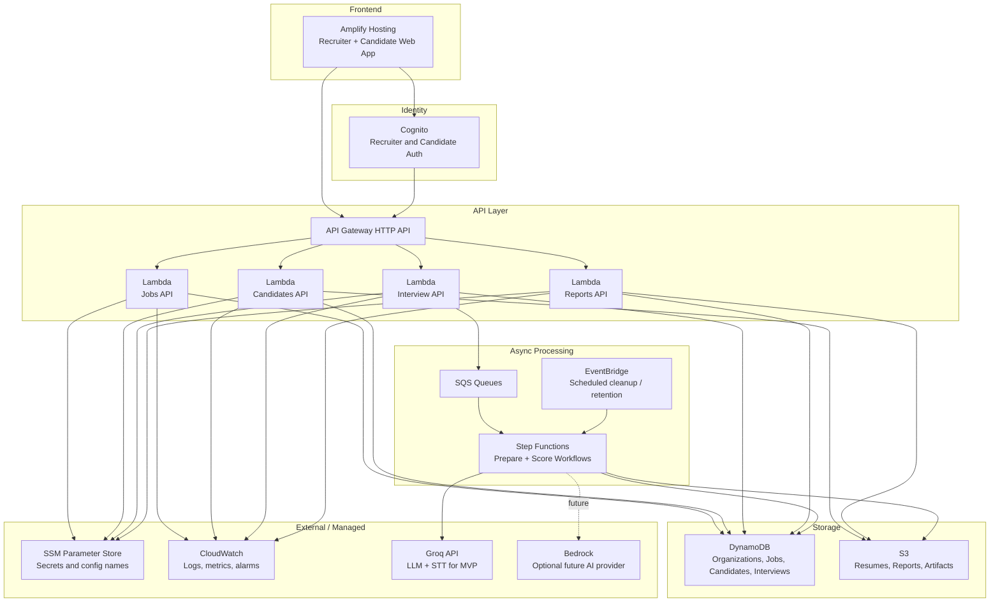

# PsySense AI - Serverless AWS Architecture

Last updated: May 5, 2026

## Executive Rule

PsySense AWS production deployment must use only the approved serverless services.

No AWS resources should be created without CEO approval.

## Allowed AWS Services

- AWS Amplify
- Amazon Cognito
- Amazon API Gateway
- AWS Lambda
- Amazon DynamoDB
- Amazon S3
- Amazon SQS
- AWS Step Functions
- Amazon EventBridge
- Amazon CloudWatch
- AWS Systems Manager Parameter Store
- Amazon Bedrock, optional future AI provider
- AWS CloudFormation / AWS SAM

## Blocked AWS Services

Do not create or deploy:

- VPCs
- EC2
- RDS
- OpenSearch
- SageMaker
- ECS or EKS
- NAT Gateways
- Load Balancers
- ElastiCache
- Redshift

## Target Architecture

## Data Model

Use a single-table DynamoDB design for the first serverless MVP.

Table: `PsySenseServerlessTable`

Primary keys:

- `pk`: partition key
- `sk`: sort key

Initial entities:

- Organization: `pk=ORG#{orgId}`, `sk=PROFILE`
- Recruiter: `pk=ORG#{orgId}`, `sk=RECRUITER#{userId}`
- Job: `pk=ORG#{orgId}`, `sk=JOB#{jobId}`
- Candidate: `pk=ORG#{orgId}`, `sk=CANDIDATE#{candidateId}`
- Interview: `pk=ORG#{orgId}`, `sk=INTERVIEW#{interviewId}`
- Usage: `pk=ORG#{orgId}`, `sk=USAGE#{yyyyMm}`

Global secondary indexes can be added later only when a real access pattern requires them.

## First Serverless MVP Flow

The first implementation proves only the foundation:

1. Recruiter signs in with Cognito.
2. Recruiter creates a job posting.
3. API Gateway calls the Jobs Lambda.
4. Jobs Lambda writes job data to DynamoDB.
5. Recruiter lists saved jobs from DynamoDB.
6. Recruiter creates candidate metadata for a job.
7. Candidate resume upload uses a short-lived S3 presigned PUT URL.

No interview scoring, resume parsing, or payment workflow is deployed until this first flow is stable.

## Cost Controls

- Use on-demand DynamoDB billing for pilot.
- Use Lambda memory/timeouts conservatively.
- Use S3 lifecycle rules for temporary artifacts.
- Use CloudWatch log retention instead of infinite retention.
- Use SQS and Step Functions only for async tasks that need them.
- Avoid provisioned capacity until usage is known.
- Do not create any blocked service even for convenience.

## AI Provider Direction

The first serverless MVP can keep Groq as the external AI provider because the current code already uses it.

Bedrock can be evaluated later if leadership wants AWS-native AI inference.

## Deployment Guardrail

Before any AWS deployment, validate the generated CloudFormation template and confirm it contains zero blocked resources:

- `AWS::EC2::*`
- `AWS::RDS::*`
- `AWS::OpenSearchService::*`
- `AWS::SageMaker::*`
- `AWS::ECS::*`
- `AWS::EKS::*`
- `AWS::ElasticLoadBalancing::*`
- `AWS::ElasticLoadBalancingV2::*`
- `AWS::ElastiCache::*`
- `AWS::Redshift::*`
